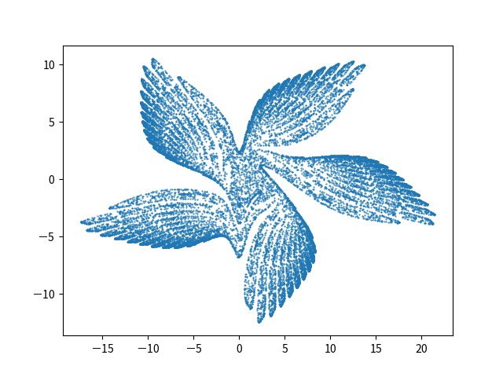

# Gumowski-Mira Map

Equation:

$$
\begin{align*}
x_{n+1} & =y_{n}+\alpha y_{n}\left(1-\sigma y_{n}{}^{2}\right)+g\left(x_{n}\right)\\
y_{n+1} & =-x_{n}+g\left(x_{n+1}\right)
\end{align*}
$$

where $g\left(x\right)=\mu x+\frac{2\left(1-\mu\right)x^{2}}{1+x^{2}}$ .

## Execution

Build:

```sh
cabal build gumowski-mira-map
```

Execute:

1. Single setting file

   ```sh
   cabal exec -- gumowski-mira-map -s setting.dhall
   ```

1. Multiple setting files

   Generate multiple setting files:

   ```sh
   cabal repl gumowski-mira-map
   ```

   in REPL:

   ```sh
   :source equations/gumowski-mira-map/writeSettingFiles.ghci
   ```

   Quit REPL:

   ```sh
   :q
   ```

   _NOTE_: `:source` is a command defined in `formulative-examples/.ghci` . To use this command outside of `formulative-examples`, add `:def source readFile` in your `.ghci` file.

   Execute for multiple setting files:

   ```sh
   find ./settingFiles -name "*.dhall" | xargs -I {} -P 4 cabal exec -- gumowski-mira-map -s {}
   ```

   Recalculate dependent variables from exported independent variable data:

   ```sh
   find ./settingFiles -name "*.dhall" | xargs -I {} cabal exec -- gumowski-mira-map --recalculation Continue -s {}
   ```

   Multiprocessing (3 process):

   ```sh
   find ./settingFiles -name "*.dhall" | xargs -P 4 -I {} cabal exec -- gumowski-mira-map --recalculation Continue -s {}
   ```

## Visualization

Create Database:

```sh
python ../../visualization-scripts/create_database.py
```

View and query database (for more details, see [Queries and Visualizations](../../visualization-scripts/README.md)):

```sh
python ../../visualization-scripts/view_database.py -H equation_alpha equation_sigma equation_mu -S equation_alpha
```

Visualization command is executed on all directories contained in `_query_result.csv` .

Plot phase space (scatter plot):

```sh
python ../../visualization-scripts/plot2d.py --data x y -S -o phase-space.png
```

View list of image files:

```sh
python ../../visualization-scripts/view_database.py -H equation_alpha equation_sigma equation_mu -S equation_alpha equation_mu -f phase-space.png
```

## Examples

$\alpha = 0.008,\sigma = 0.05, \mu = -0.496, x_0 = 1.0, y_0 = 1.0$


$ \alpha = 0.009, \sigma =  0.05,\mu = -0.801, x_0 = 1.0, y_0 = 1.0$



## References

- https://ja.wikipedia.org/wiki/%E3%82%B0%E3%83%A2%E3%82%A6%E3%82%B9%E3%82%AD%E3%83%BC%E3%83%BB%E3%83%9F%E3%83%A9%E3%81%AE%E5%86%99%E5%83%8F
- https://www.researchgate.net/publication/263469351_ABOUT_WHAT_IS_CALLED_GUMOWSKI-MIRA_MAP
- https://www.youtube.com/watch?v=AdcTAYLgYFI
