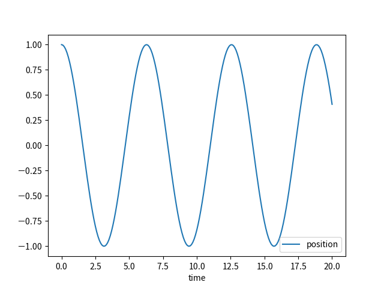
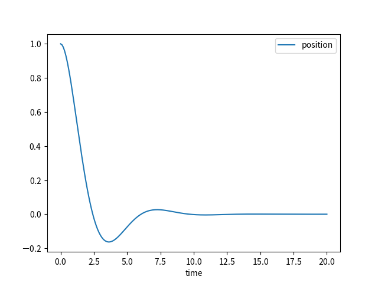
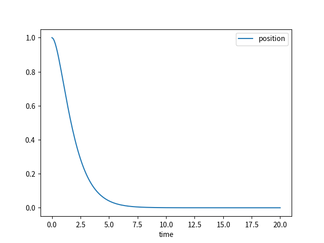
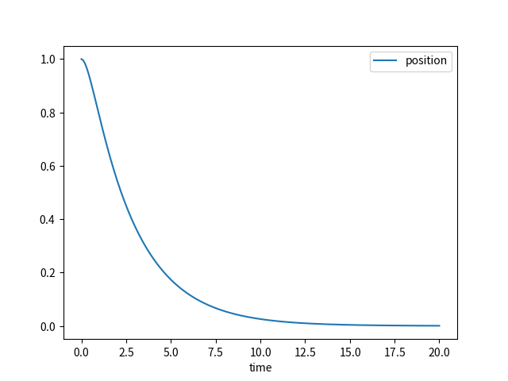

# Harmonic Oscillator

equation:

$$
\global\long\def\d{\mathrm{d}}%
\global\long\def\D#1#2{\frac{\d#1}{\d#2}}%
\global\long\def\vari{x}%
\global\long\def\varii{p}%
\global\long\def\parami{t}%
\global\long\def\mass{m}%
\global\long\def\viscousDampingCoefficient{\gamma}%
\global\long\def\springConstant{k}%
\begin{align*}
\D x{\parami} & =\frac{\varii}{\mass}\\
\D{\varii}{\parami} & =-\frac{\viscousDampingCoefficient}{\mass}\varii-\springConstant\vari
\end{align*}
$$

scheme:

$$
\global\long\def\vari{x}%
\global\long\def\varii{p}%
\global\long\def\indexI{i}%
\begin{align*}
\frac{x_{\indexI+1}-x_{\indexI}}{\Delta t} & -\frac{p_{\indexI+1}+p_{\indexI}}{m}=0\\
\frac{p_{\indexI+1}-p_{\indexI}}{\Delta t} & +\frac{\gamma}{m}\frac{p_{\indexI+1}+p_{\indexI}}{2}+k\frac{\vari_{\indexI+1}+\vari_{\indexI}}{2}=0
\end{align*}
$$

## Execution

Build:

```sh
cabal build harmonic-oscillator
```

Execute:

1. single setting file

   ```sh
   cabal exec -- harmonic-oscillator -s setting.dhall
   ```

1. multiple setting files

   generate multiple setting files:

   ```sh
   cabal repl harmonic-oscillator
   ```

   in REPL:

   ```sh
   :source equations/harmonic-oscillator/writeSettingFiles.ghci
   ```

   quit REPL:

   ```sh
   :q
   ```

   _NOTE_: `:source` is a command defined in `formulative-examples/.ghci` . To use this command outside of `formulative-examples`, add `:def source readFile` in your `.ghci` file.

   execute for multiple setting files:

   ```sh
   find ./settingFiles -name "*.dhall" | xargs -I {} -P 4 cabal exec -- harmonic-oscillator -s {}
   ```

   Recalculate dependent variables from exported independent variable data:

   ```sh
   find ./settingFiles -name "*.dhall" | xargs -I {} cabal exec -- harmonic-oscillator --recalculation Continue -s {}
   ```

   Multiprocessing (3 process):

   ```sh
   find ./settingFiles -name "*.dhall" | xargs -P 4 -I {} cabal exec -- harmonic-oscillator --recalculation Continue -s {}
   ```

## Visualization

Create Database:

```sh
python ../../visualization-scripts/create_database.py
```

View and query database (for more details, see [Queries and Visualizations](../../visualization-scripts/README.md)):

```sh
python ../../visualization-scripts/view_database.py -H equation_dampingRatio equation_x0 equation_p0
```

Time evolution:

```sh
python ../../visualization-scripts/plot_time_evolution.py -t time.csv -x position.csv -o t-x.png
```

Phase space:

```sh
python ../../visualization-scripts/plot2d.py --x position.csv --y momentum.csv
```

All global quantities:

```sh
python ../../visualization-scripts/plot_global_quantity.py --parameter time.csv --data dependentVariable/_global.csv
```

Global quantities for selected labels (in this case `hamiltonian`, `dHdt`, `power`):

```sh
python ../../visualization-scripts/plot_global_quantity.py --parameter time.csv --data dependentVariable/_global.csv --header hamiltonian dHdt power
```

## Examples

damping ratio: $\zeta=\frac{\gamma}{2\sqrt{mk}}$

$m = 1.0, k = 1.0, \gamma = 0.0, x_0 = 1.0, p_0 = 0.0$ ($\zeta=0.0$)



$m = 1.0, k = 1.0, \gamma = 1.0, x_0 = 1.0, p_0 = 0.0$ ($\zeta=0.5$)



$m = 1.0, k = 1.0, \gamma = 2.0, x_0 = 1.0, p_0 = 0.0$ ($\zeta=1.0$)



$m = 1.0, k = 1.0, \gamma = 3.0, x_0 = 1.0, p_0 = 0.0$ ($\zeta=1.5$)



## References

- https://en.wikipedia.org/wiki/Harmonic_oscillator
