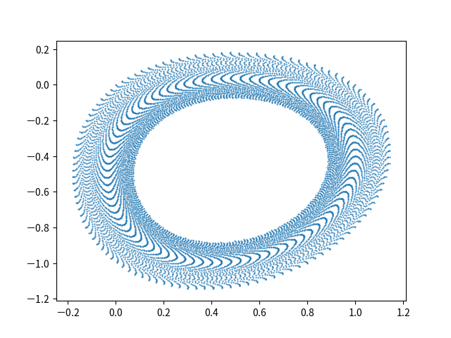

# Hénon Map

equation:

$$
\begin{align*}
x_{n+1} & =1-ax_{n}{}^{2}+y_{n}\\
y_{n+1} & =bx_{n}
\end{align*}
$$

## Execution

Build:

```
cabal build henon-map
```

Execute:

1. Single setting file

   ```
   cabal exec -- henon-map -s setting.dhall
   ```

1. Multiple setting files

   Generate multiple setting files:

   ```
   cabal repl henon-map
   ```

   in REPL:

   ```
   :source equations/henon-map/writeSettingFiles.ghci
   ```

   Quit REPL:

   ```
   :q
   ```

   _NOTE_: `:source` is a command defined in `formulative-examples/.ghci` . To use this command outside of `formulative-examples`, add `:def source readFile` in your `.ghci` file.

   Execute for multiple setting files:

   ```
   find ./settingFiles -name "*.dhall" | xargs -I {} -P 4 cabal exec -- henon-map -s {}
   ```

   Recalculate dependent variables from exported independent variable data:

   ```
   find ./settingFiles -name "*.dhall" | xargs -I {} cabal exec -- henon-map --recalculation Continue -s {}
   ```

   Multiprocessing (3 process):

   ```
   find ./settingFiles -name "*.dhall" | xargs -P 4 -I {} cabal exec -- henon-map --recalculation Continue -s {}
   ```

## Visualization

Create Database:

```
python ../../visualization-scripts/create_database.py
```

View and query database (for more details, see [Queries and Visualizations](../../visualization-scripts/README.md)):

```
python ../../visualization-scripts/view_database.py -H equation_a equation_b -S equation_a equation_b
```

Visualization command is executed on all directories contained in `_query_result.csv` .

Plot phase space (scatter plot):

```
python ../../visualization-scripts/plot2d.py --data x y -S -o phase-space.png
```

View list of image files:

```
python ../../visualization-scripts/view_database.py -H equation_a equation_b -f phase-space.png
```

## Examples

$a = 1.4, b = 0.3, x_0 = 0.0, y_0 = 0.0$


$a = 0.2, b = 0.9991, x_0 = 0.0, y_0 = 0.0$


$a = 0.2, b = -0.9999, x_0 = 0.0, y_0 = 0.0$



## References

- https://en.wikipedia.org/wiki/H%C3%A9non_map
- https://mathworld.wolfram.com/HenonMap.html
