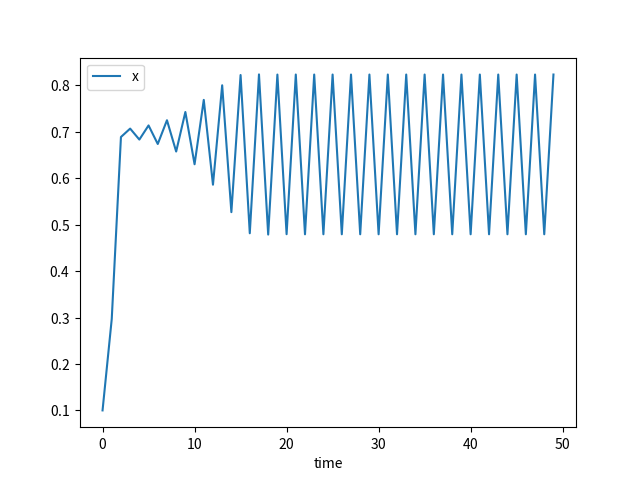

# Logistic Map

Equation:

$$
\begin{align*}
x_{n+1} & =rx_{n}\left(1-x_{n}\right)
\end{align*}
$$

## Execution

Build:

```sh
cabal build logistic-map
```

Execute:

1. Single setting file

   ```sh
   cabal exec -- logistic-map -s setting.dhall
   ```

1. Multiple setting files

   Generate multiple setting files:

   ```sh
   cabal repl logistic-map
   ```

   in REPL:

   ```sh
   :source equations/logistic-map/writeSettingFiles.ghci
   ```

   Quit REPL:

   ```sh
   :q
   ```

   _NOTE_: `:source` is a command defined in `formulative-examples/.ghci` . To use this command outside of `formulative-examples`, add `:def source readFile` in your `.ghci` file.

   Execute for multiple setting files (Multiprocessing):

   ```sh
   find ./settingFiles -name "*.dhall" | xargs -I {} -P 4 cabal exec -- logistic-map -s {}
   ```

## Visualization

Create Database:

```sh
python ../../visualization-scripts/create_database.py
```

View and query database (for more details, see [Queries and Visualizations](../../visualization-scripts/README.md)):

```sh
python ../../visualization-scripts/view_database.py -H equation_r -S equation_r
```

Visualization command is executed on all directories contained in `_query_result.csv` .

Time evolution:

```sh
python ../../visualization-scripts/plot_time_evolution.py -t time --data x -o t-x.png
```

View list of image files:

```sh
python ../../visualization-scripts/view_database.py -H equation_r -f t-x.png
```

## Examples

$r = 2.8$


$r = 3.3$



$r = 3.55$


$r = 3.6$


## References

- https://en.wikipedia.org/wiki/Logistic_map
