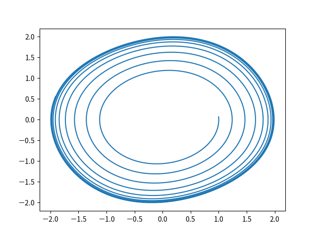
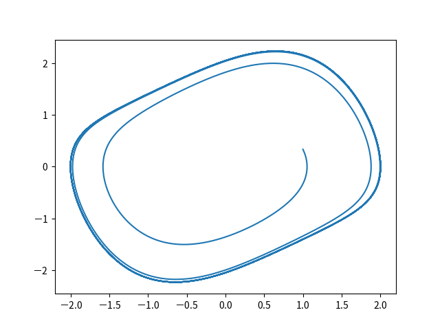
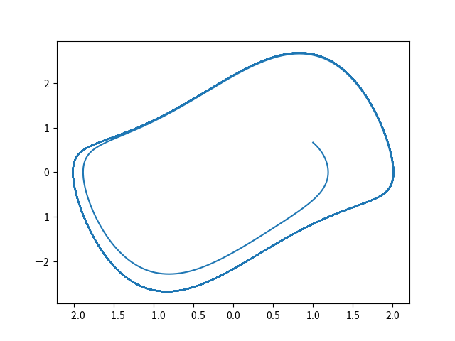
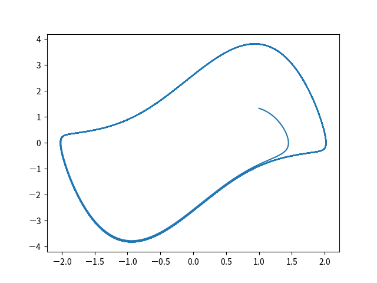
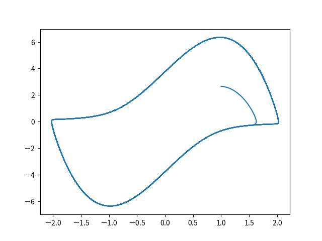

# Van der Pol Equation

Equation:

$$
\begin{align*}
\frac{\mathrm{d}x}{\mathrm{d}t} & =\mu\left(x-\frac{1}{3}x^{3}-y\right)\\
\frac{\mathrm{d}y}{\mathrm{d}t} & =\frac{1}{\mu}x
\end{align*}
$$

Scheme:

$$
\begin{align*}
 & \frac{x^{(i+1)}-x^{(i)}}{\Delta t}-\mu\left(\frac{x^{(i+1)}+x^{(i)}}{2}-\frac{1}{3}f\left(x^{(i+1)},x^{(i)}\right)-\frac{y^{(i+1)}+y^{(i)}}{2}\right)=0\\
 & \frac{y^{(i+1)}-y^{(i)}}{\Delta t}-\frac{1}{\mu}\left(\frac{x^{(i+1)}+x^{(i)}}{2}\right)=0
\end{align*}
$$

where $f\left(x^{(i+1)},x^{(i)}\right)=\frac{1}{4}\left(\left(x^{(i+1)}\right)^{3}+\left(x^{(i+1)}\right)^{2}x^{(i)}+x^{(i+1)}\left(x^{(i+1)}\right)^{2}+\left(x^{(i)}\right)^{3}\right)$

## Execution

Build:

```
cabal build van-der-pol-oscillator
```

Execute:

1. Single setting file

   ```
   cabal exec -- van-der-pol-oscillator -s setting.dhall
   ```

1. Multiple setting files

   Generate multiple setting files:

   ```
   cabal repl van-der-pol-oscillator
   ```

   in REPL:

   ```
   :source equations/van-der-pol-oscillator/writeSettingFiles.ghci
   ```

   Quit REPL:

   ```
   :q
   ```

   _NOTE_: `:source` is a command defined in `formulative-examples/.ghci` . To use this command outside of `formulative-examples`, add `:def source readFile` in your `.ghci` file.

   Execute for multiple setting files (Multiprocessing):

   ```
   find ./settingFiles -name "*.dhall" | xargs -I {} -P 4 cabal exec -- van-der-pol-oscillator -s {}
   ```

## Visualization

### Query

Create database:

```
python ../../visualization-scripts/create_database.py
```

View and query database (the results are exported to `output/_query_result.csv`):

```
python ../../visualization-scripts/view_database.py -H equation_mu -S equation_mu
```

### Plot

The following visualization scripts are executed on all directories contained in `output/_query_result.csv` .

Plot x-xdot space:

```
python ../../visualization-scripts/plot2d.py --data x dependentVariable/xdot -o x-xdot.png
```

View list of image files:

```
python ../../visualization-scripts/view_database.py -H equation_mu -S equation_mu -f x-xdot.png
```

Plot animation (interval=20, framerate=10):

```
python ../../visualization-scripts/plot2d_animation.py --data x dependentVariable/xdot -o variable.mp4 -i 20 -f 10
```

## Exmaples

$\mu=0.1$:



$\mu=0.5$:



$\mu=1.0$:



$\mu=2.0$:



$\mu=4.0$:



## References:

- https://en.wikipedia.org/wiki/Van_der_Pol_oscillator
